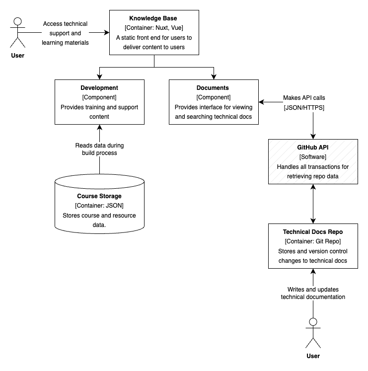

# PHS Data Science - Knowledge Base

[](https://github.com/Public-Health-Scotland/knowledge-base/releases/latest)

The PHS Data Science Knowledge Base is a web app that collates all resources related to Data Science (R, Python, git, etc.) created by and for PHS staff. This includes booking for in-person and access to online training, guidance documents, and internally developed textbooks. There is also a social page for announcements related to Data Science in the organisation, social links, and a list of relevant external materials such as textbooks and blogs.

## Directory structure

```markdown
├── assets // static resource
│   ├── courses.json // data for courses and content
├── docs // build 
├── layouts // layouts
│   ├── default.vue // site-wide template
├── pages // pages
│   ├── index.vue // homepage
│   ├── social.vue // social page
├── plugins // external components
├── static // static resources like images
├── .gitignore // gitignore
└── package.json // package.json
```

## Application Architecture

The app is built with Nuxt.js, a Vue.js framework. The app is built with a single-page application (SPA) architecture, with the main page being the homepage, a development page for training resource, a documentation page for support articles and the social page for cross-org annoucements and external resources. The app is built with is responsive to different screen sizes, including mobile and desktop.

### Component Diagram



## Build Setup

The project is built with Vue and Nuxt, and is deployed using GitHub Pages.

```bash
# install dependencies
$ npm install

# serve with hot reload at localhost:3000
$ npm run dev

# build for production and launch server
$ npm run build
$ npm run start

# generate static project
$ npm run generate
```

## Contributing

This app currently has one developer, [Russell McCreath](https://github.com/rmccreath) with oversight from the [PHS Data Science team](mailto:phs.datascience@phs.scot). For details on how to contribute, please see the [contribution guidance](https://github.com/Public-Health-Scotland/knowledge-base/blob/master/CONTRIBUTING.md).
